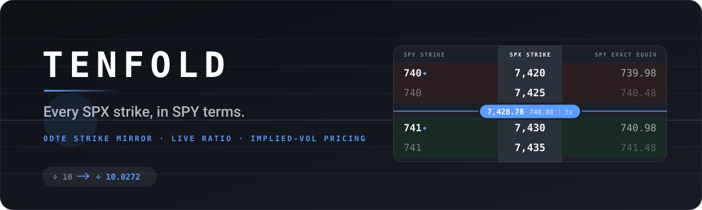
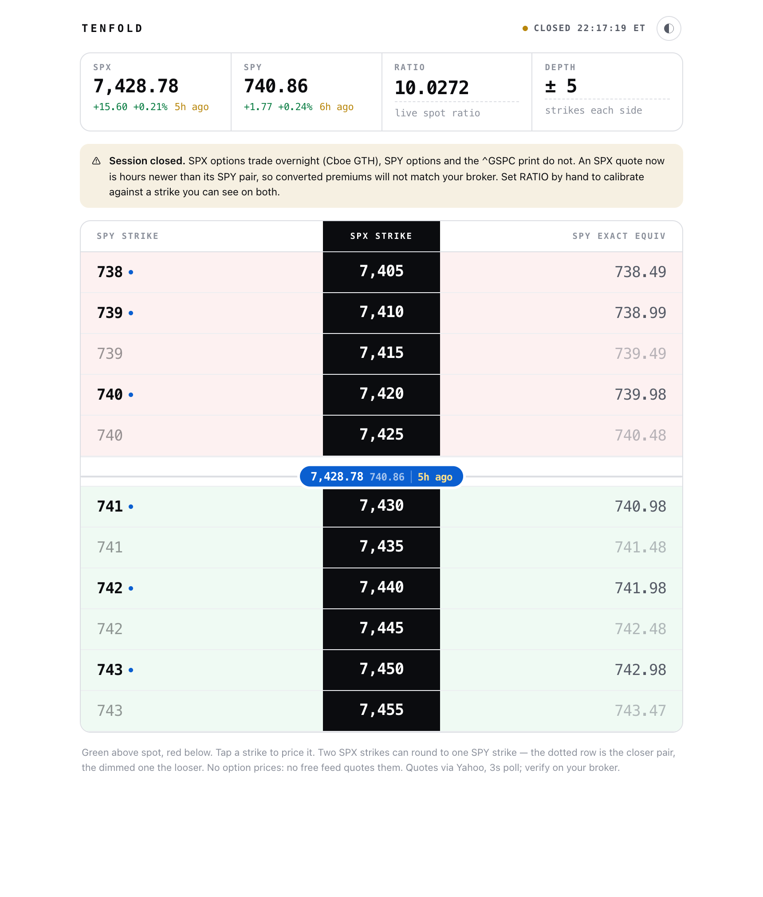
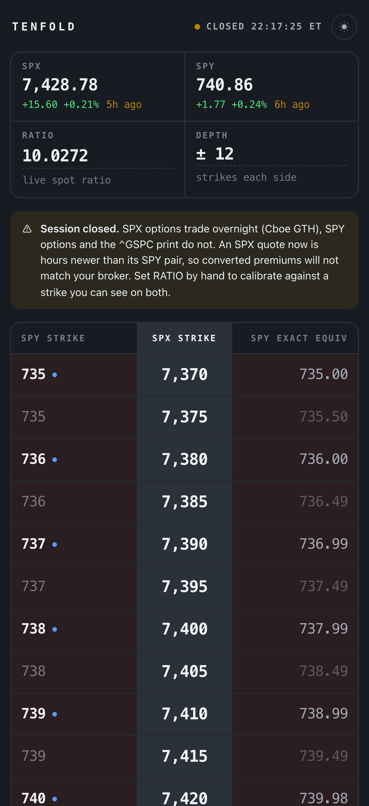
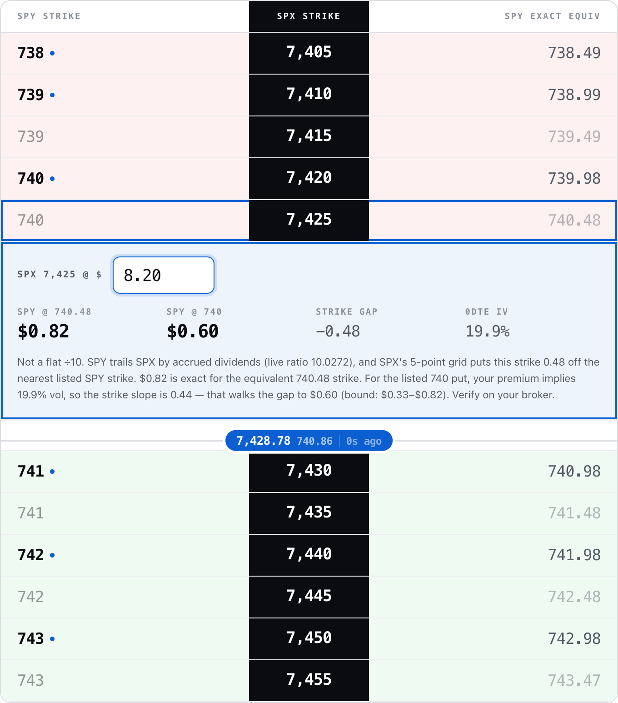

<div align="center">



<br><br>

**The SPX ↔ SPY strike mirror for 0DTE.**

SPY is not SPX ÷ 10 — and on 0DTE that difference is a strike.

<br>


[**Open it**](https://ratterau.github.io/tenfold/) · [**The problem**](#the-problem) · [**Reading the screen**](#reading-the-screen) · [**Pricing a strike**](#pricing-a-strike) · [**Under the hood**](#under-the-hood)

<sub>One HTML file. No install, no signup, no key.</sub>

</div>

---

<div align="center">
  
  &nbsp;
  
  <br>
  <sub><b>Desktop</b> · <b>Phone</b> — same tiles, reflowed. Real screenshots, real quotes, nothing mocked up.</sub>
</div>

---

## The problem

SPY tracks the S&P 500 minus accrued dividends, so it doesn't sit at exactly one tenth of the index. The real ratio floats around **10.02–10.06** and drifts through every quarter.

Which means the reflex — *SPX 7430, so SPY 743* — is wrong by half a strike. SPY 743 is really SPX **7450**. On a 30-day position, shrug. On 0DTE, where the whole trade lives inside two strikes of gamma, that's the difference between the contract you meant and the one you clicked.

TENFOLD does the division for you, against the live ratio, continuously.

## Reading the screen

**Strikes ascend** down the page, the way a broker chain reads. **Green above spot, red below** — the side you're on is legible from across the room. **DEPTH** sets how many strikes sit each side of spot, from ±5 to ±50; the ladder scrolls and keeps spot centred, and your choice is remembered.

Every quote carries **how old the exchange says the print is** — `2s ago` under a live tick, amber once it drifts past 30 seconds, hours when the market's shut. The **spot band carries its own age too**, because that's the number people actually read. A figure that stopped updating should say so rather than sit there looking current.

The **spot line** rides between the two bracketing strikes and drifts inside the gap as price moves, so you watch spot creep toward a strike instead of a divider snapping five points at a time. Both spots sit in the pill.

Then there's the **blue dot**, which is the whole reason this exists:

```
  SPY      SPX      EXACT
  740     7,420    739.98   ●
  740     7,425    740.48
─────── 7,428.78  740.86 ───────
  741     7,430    740.98   ●
  741     7,435    741.48
```

Two SPX strikes round onto the same SPY strike, and at a glance they look equally valid. They aren't. `7430 → 740.98` is a clean SPY 741. `7435 → 741.48` is half a strike off and is nothing like the same contract. The dot marks the real pair; its twin is dimmed so it can't be misread.

## Pricing a strike

Tap any row and it opens in place — no separate calculator, no losing your spot on the ladder.

<div align="center">
  
  <br>
  <sub>Real quotes. Page clock set to 13:30 ET so the vol solve is in play — after the close it correctly refuses to run.</sub>
</div>

Type what you paid on SPX and you get two numbers, because there are honestly two:

**`SPY @ 740.48` — exact.** Divide the premium by the live ratio and you have the premium of an SPY option struck at `k / ratio`. That's not an approximation: the payoff scales exactly. The catch is that `740.48` isn't listed anywhere.

**`SPY @ 740` — estimated.** Moving to the strike your broker actually lists is where the error hides, and most converters silently round it away. Two things pin it down instead:

- The **bound**. Premium can never move faster than 1:1 with strike, so the listed premium sits within `|gap|` of the exact one — calls fall as strike rises, puts rise. No model, no assumptions, always true.
- The **estimate**. The bound is worst case; the real slope is `dC/dK = −N(d₂)`. And the premium you just typed already determines the vol that fixes it. TENFOLD bisects Black-Scholes for σ against the 0DTE clock, reads the slope, and walks the gap.

For the panel above that's the difference between *"somewhere in $0.33–$0.82"* and **$0.60**, from an implied 19.9% vol and a strike slope of 0.44. The estimate is clamped inside the bound, and falls back to it whenever no vol solves the premium or the session is over.

Treat the output as an anchor for sizing and comparison. It is not a quote.

## The ratio is a knob

Spot ÷ spot is only right while both legs quote live. Overnight it isn't: **SPX options keep trading on Cboe Global Trading Hours while SPY options and the `^GSPC` print stop at the close.** An SPX quote taken at 9pm is hours newer than its SPY pair, and no formula reconciles two different timestamps.

So TENFOLD says so — a banner whenever the session is shut — and the **RATIO tile is editable**. Calibrate it against any strike you can see quoted on both, and every conversion on the page follows. It's persisted, with an `auto` link to hand control back.

This is also the fix if you're mirroring something other than SPX/SPY.

## Why there are no bid/ask columns

Because nothing free is fast enough to deserve them.

No public feed quotes options faster than once per second. Yahoo's chain is delayed and only refreshes on request; everything genuinely real-time — Polygon, Tradier, CBOE, broker APIs — is keyed and paid. Painting delayed numbers in a layout that implies they're live is worse than showing nothing, so TENFOLD shows strikes.

Spot for SPX and SPY refreshes every 3 seconds and is near-real-time.

Want real option prices? Replace `quote()` in `index.html` with a keyed feed. It's the only function that touches the network.

## Running it yourself

```bash
git clone https://github.com/RatterAU/tenfold.git
cd tenfold
open index.html
```

That's the whole setup. No build, no dependencies, no package.json. Serve it with `python3 -m http.server 8000` if you'd rather, or drop `index.html` on any static host.

Sanity-check the maths anytime: open the console and run `tenfoldCheck()`. It asserts the strike mapping, the best-pair choice, the spot-line geometry, the normal CDF, an implied-vol round trip, the slope signs, and that the estimate never escapes its bound.

## Under the hood

| | |
|---|---|
| **Size** | one file, ~27 KB, zero dependencies |
| **Data** | Yahoo Finance chart endpoint (`^GSPC`, `SPY`), 3s poll |
| **Ladder** | ±5 to ±50 strikes, 5-point SPX grid, spot kept centred |
| **SPY grid** | $1 strikes |
| **Pricing** | exact ratio scaling, plus Black-Scholes implied vol for the listed-strike step |
| **Clock** | America/New_York, DST handled |
| **Theme** | light / dark, remembered in localStorage |
| **Mobile** | responsive to 360px |

Change `WIDTH` at the top of the script for a different SPX strike spacing. The ladder HTML is diffed between polls, so a tick that changes nothing skips the re-render entirely.

**On the CORS relay:** Yahoo sends no CORS headers, so the browser reaches it through a public relay — `cors.lol`, then `cors.sh`, then `allorigins`, failing over automatically. Those are free, rate-limited, and run by strangers. Fine for personal use. If this ever picks up real traffic they'll throttle it and the app will sit on RECONNECTING. The fix is a small Cloudflare Worker proxying Yahoo, then point `RELAYS` at it — the free tier covers far more than this needs.

## What this isn't

No chains, no greeks beyond the one slope it needs, no P/L, no order entry. Strike and price geometry, nothing else.

And SPX and SPY options are **comparable, not interchangeable**. SPX is cash-settled, European-exercise, 1256-taxed, $100 multiplier. SPY is American-exercise with early-assignment and ex-dividend risk. TENFOLD maps the strikes; it doesn't claim the two positions are the same trade.

## Fine print

Little tool I built for myself. It's not financial advice, I'm not liable for anything you do with it, and the numbers come from a free feed that can be wrong or stale — check every strike on your broker before you send an order.

MIT licensed. Take it, fork it, do whatever.
